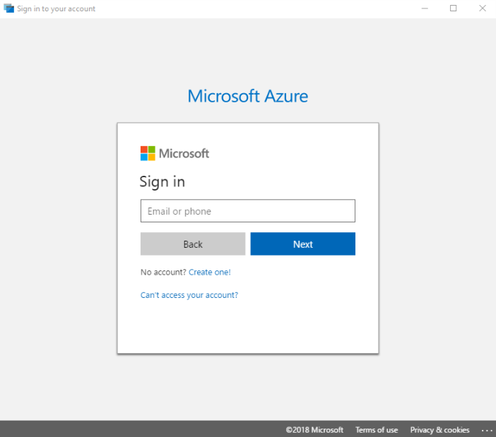
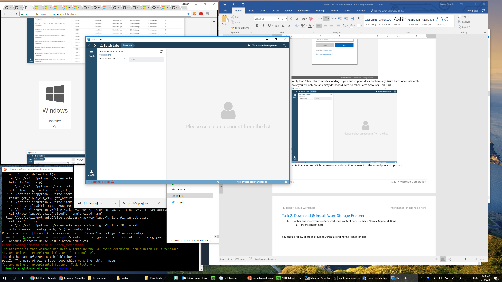
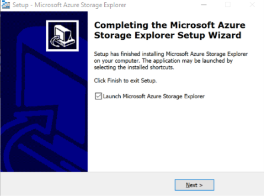

# Big Compute setup

## Requirements

-   Microsoft Azure subscription (non-Microsoft subscription)

-   Local machine running Windows or Mac OS X

## Before the hands-on lab

Duration: 15 minutes

Prior to starting the hands-on lab, you should download and install the tools in this section on to the computer you will be using to complete the lab.

### Task 1: Download and Install Batch Labs

1.  Using a browser on your local machine, navigate to: <https://azure.github.io/BatchLabs/>

2.  Scroll down until you see the Downloads section

3.  Select the download appropriate to your OS (e.g., select Installer for Window or DMG for OS X). The instructions that follow assume you are installing on Windows\
    

4.  Run the installer\
    

5.  Sign in using the account associated with your Azure Subscription\
    

6.  Verify that Batch Labs completes loading. If your subscription does not have any Azure Batch Accounts, then at this point you will only see an empty dashboard, with no other Batch Accounts. This is OK\
    

7.  Note that you can switch between your subscription be selecting the subscriptions drop down\
    

8.  Your installation of Batch Labs is ready for use

### Task 2: Download and Install Azure Storage Explorer

1.  Using a browser on your local machine, navigate to: <https://azure.microsoft.com/features/storage-explorer/>

2.  Use the drop-down to select the **operating system** running on your local machine and select **Download Storage Explorer for free**. The steps that follow assume you are running Windows, but Mac OS X and Linux are also supported.\
    

3.  Run the downloaded installed (e.g., StorageExplorer.exe)

4.  Accept the License Agreement and select Install\
    

5.  Allow the installation to proceed. Leave the Launch Microsoft Azure Storage Explorer box checked and select Next on the final dialog to complete the installation.\
    

6.  Leave Storage Explorer open and continue with the lab

You should follow all steps provided *before* attending the Hands-on lab.
