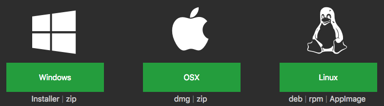
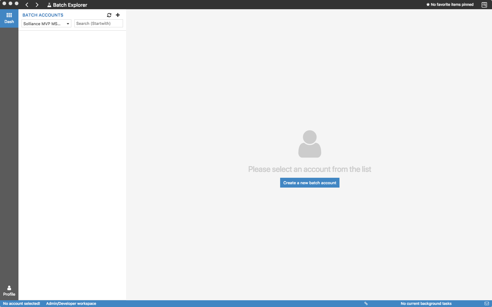
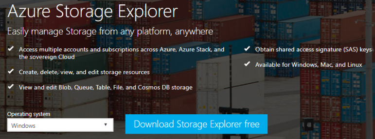

High Performance Computing

Before the hands-on lab setup guide

August 2019

Information in this document, including URL and other Internet Web site references, is subject to change without notice. Unless otherwise noted, the example companies, organizations, products, domain names, e-mail addresses, logos, people, places, and events depicted herein are fictitious, and no association with any real company, organization, product, domain name, e-mail address, logo, person, place or event is intended or should be inferred. Complying with all applicable copyright laws is the responsibility of the user. Without limiting the rights under copyright, no part of this document may be reproduced, stored in or introduced into a retrieval system, or transmitted in any form or by any means (electronic, mechanical, photocopying, recording, or otherwise), or for any purpose, without the express written permission of Microsoft Corporation.

Microsoft may have patents, patent applications, trademarks, copyrights, or other intellectual property rights covering subject matter in this document. Except as expressly provided in any written license agreement from Microsoft, the furnishing of this document does not give you any license to these patents, trademarks, copyrights, or other intellectual property.

The names of manufacturers, products, or URLs are provided for informational purposes only and Microsoft makes no representations and warranties, either expressed, implied, or statutory, regarding these manufacturers or the use of the products with any Microsoft technologies. The inclusion of a manufacturer or product does not imply endorsement of Microsoft of the manufacturer or product. Links may be provided to third party sites. Such sites are not under the control of Microsoft and Microsoft is not responsible for the contents of any linked site or any link contained in a linked site, or any changes or updates to such sites. Microsoft is not responsible for webcasting or any other form of transmission received from any linked site. Microsoft is providing these links to you only as a convenience, and the inclusion of any link does not imply endorsement of Microsoft of the site or the products contained therein.

© 2019 Microsoft Corporation. All rights reserved.

Microsoft and the trademarks listed at <https://www.microsoft.com/en-us/legal/intellectualproperty/Trademarks/Usage/General.aspx> are trademarks of the Microsoft group of companies. All other trademarks are property of their respective owners.

**Contents**

<!-- TOC -->

- [High Performance Computing before the hands-on lab setup guide](#High-performance-computing-before-the-hands-on-lab-setup-guide)
  - [Requirements](#Requirements)
  - [Before the hands-on lab](#Before-the-hands-on-lab)
    - [Task 1: Download and Install Batch Explorer](#Task-1-Download-and-Install-Batch-Explorer)
    - [Task 2: Download and Install Azure Storage Explorer](#Task-2-Download-and-Install-Azure-Storage-Explorer)

<!-- /TOC -->

# High Performance Computing before the hands-on lab setup guide

## Requirements

- Microsoft Azure subscription (non-Microsoft subscription, must be a pay-as-you subscription).
- Local machine running Windows or Mac OS X.

## Before the hands-on lab

Duration: 15 minutes

Prior to starting the hands-on lab, you should download and install the tools in this section on to the computer you will be using to complete the lab.

### Task 1: Download and Install Batch Explorer

1. Using a browser on your local machine, navigate to: <https://azure.github.io/BatchExplorer/>.

2. Scroll down until you see the Downloads section.

3. Select the download appropriate to your OS (e.g., select Installer for Window or DMG for OS X). The instructions that follow assume you are installing on Windows.

    

4. Run the installer.

    

5. Sign in using the account associated with your Azure Subscription.

    

6. Verify that Batch Explorer completes loading. If your subscription does not have any Azure Batch Accounts, then at this point you will only see an empty dashboard, with no other Batch Accounts. This is OK.

    

7. Note that you can switch between your subscription be selecting the subscriptions drop down.

    

8. Your installation of Batch Explorer is ready for use.

### Task 2: Download and Install Azure Storage Explorer

1. Using a browser on your local machine, navigate to: <https://azure.microsoft.com/features/storage-explorer/>.

2. Use the drop-down to select the **operating system** running on your local machine and select **Download Storage Explorer for free**. The steps that follow assume you are running Windows, but Mac OS X and Linux are also supported.

    

3. Run the downloaded installed (e.g., StorageExplorer.exe).

4. Accept the License Agreement and select Install.

    

5. Allow the installation to proceed. Leave the Launch Microsoft Azure Storage Explorer box checked and select Next on the final dialog to complete the installation.

    

6. Leave Storage Explorer open and continue with the lab.

You should follow all steps provided *before* attending the Hands-on lab.
