<div class="MCWHeader1">
Big Compute
</div>

<div class="MCWHeader2">
Hands-on lab step-by-step
</div>

<div class="MCWHeader3">
September 2018
</div>

Information in this document, including URL and other Internet Web site references, is subject to change without notice. Unless otherwise noted, the example companies, organizations, products, domain names, e-mail addresses, logos, people, places, and events depicted herein are fictitious, and no association with any real company, organization, product, domain name, e-mail address, logo, person, place or event is intended or should be inferred. Complying with all applicable copyright laws is the responsibility of the user. Without limiting the rights under copyright, no part of this document may be reproduced, stored in or introduced into a retrieval system, or transmitted in any form or by any means (electronic, mechanical, photocopying, recording, or otherwise), or for any purpose, without the express written permission of Microsoft Corporation.

Microsoft may have patents, patent applications, trademarks, copyrights, or other intellectual property rights covering subject matter in this document. Except as expressly provided in any written license agreement from Microsoft, the furnishing of this document does not give you any license to these patents, trademarks, copyrights, or other intellectual property.

The names of manufacturers, products, or URLs are provided for informational purposes only and Microsoft makes no representations and warranties, either expressed, implied, or statutory, regarding these manufacturers or the use of the products with any Microsoft technologies. The inclusion of a manufacturer or product does not imply endorsement of Microsoft of the manufacturer or product. Links may be provided to third party sites. Such sites are not under the control of Microsoft and Microsoft is not responsible for the contents of any linked site or any link contained in a linked site, or any changes or updates to such sites. Microsoft is not responsible for webcasting or any other form of transmission received from any linked site. Microsoft is providing these links to you only as a convenience, and the inclusion of any link does not imply endorsement of Microsoft of the site or the products contained therein.
© 2018 Microsoft Corporation. All rights reserved.

Microsoft and the trademarks listed at <https://www.microsoft.com/en-us/legal/intellectualproperty/Trademarks/Usage/General.aspx> are trademarks of the Microsoft group of companies. All other trademarks are property of their respective owners.

**Contents**

<!-- TOC -->

- [Big Compute hands-on lab step-by-step](#big-compute-hands-on-lab-step-by-step)
  - [Abstract and learning objectives](#abstract-and-learning-objectives)
  - [Overview](#overview)
  - [Solution architecture](#solution-architecture)
  - [Requirements](#requirements)
  - [Exercise 1: Provision Batch Environment](#exercise-1-provision-batch-environment)
    - [Task 1: Setup a Linux Jump Box](#task-1-setup-a-linux-jump-box)
    - [Task 2: Install the Azure CLI and Azure Batch Extensions](#task-2-install-the-azure-cli-and-azure-batch-extensions)
    - [Task 3: Provision Azure Batch](#task-3-provision-azure-batch)
  - [Exercise 2: Creating Batch CLI templates and files](#exercise-2-creating-batch-cli-templates-and-files)
    - [Task 1: Connect to Azure Batch with Batch Explorer](#task-1-connect-to-azure-batch-with-batch-explorer)
    - [Task 2: Stage the sample videos to process](#task-2-stage-the-sample-videos-to-process)
    - [Task 3: Verify video uploads](#task-3-verify-video-uploads)
    - [Task 4: Create an Azure Batch Pool Template](#task-4-create-an-azure-batch-pool-template)
    - [Task 5: Create an Azure Batch Job Template](#task-5-create-an-azure-batch-job-template)
  - [Exercise 3: Running a Batch Job](#exercise-3-running-a-batch-job)
    - [Task 1: Create a Pool using the Azure Batch Pool Template](#task-1-create-a-pool-using-the-azure-batch-pool-template)
    - [Task 2: Create and Run a Job using the Azure Batch Job Template](#task-2-create-and-run-a-job-using-the-azure-batch-job-template)
  - [Exercise 4: Scaling a Pool](#exercise-4-scaling-a-pool)
    - [Task 1: Enable Autoscale on the Pool](#task-1-enable-autoscale-on-the-pool)
    - [Task 2: Apply an Autoscale Formula](#task-2-apply-an-autoscale-formula)
    - [Task 3: Trigger and observe Autoscale](#task-3-trigger-and-observe-autoscale)
  - [Exercise 5: 3D Rendering with the Batch Rending Service](#exercise-5-3d-rendering-with-the-batch-rending-service)
    - [Task 1: Create the File Groups](#task-1-create-the-file-groups)
    - [Task 1: Render a 3ds Max Scene](#task-1-render-a-3ds-max-scene)
  - [After the hands-on lab](#after-the-hands-on-lab)
    - [Task 1: Cleanup the Lab Resource Group.](#task-1-cleanup-the-lab-resource-group)

<!-- /TOC -->

# Big Compute hands-on lab step-by-step

## Abstract and learning objectives

In this hands-on lab, you will implement big compute workloads targeted at 3D rendering and media processing in Azure using Azure Batch and Azure Storage.

At the end of this hands-on lab, you will be better able to deploy Azure Batch and an Azure Batch Pool consisting of Linux Virtual Machines. You will be able to configure the pool of VMs to run the FFmpeg app to process videos across the VM nodes in the pool. You will be able to do this using Batch templates and files, which enable you to perform scale-out execution of command line executables (in this case FFmpeg) without having to write any code.

## Overview

The Big Compute hands-on lab will enable you to understand how to implement big compute workloads targeted at 3D rendering and media processing in Azure using Azure Batch and Azure Storage.

## Solution architecture

Below is a diagram of the solution architecture you will build in this lab. Please study this carefully, so you understand the whole of the solution as you are working on the various components.


In this lab, you deploy Azure Batch and an Azure Batch Pool consisting of Linux Virtual Machines. The Pool of VMs is configured to run the FFmpeg app to process videos across the VM nodes in the pool. This is done using Batch templates and files, which enable you to perform scale-out execution of command line executables (in this case FFmpeg) without having to write any code. You can use Azure Batch Explorer or the Azure CLI to manage and monitor jobs executing in the Pool.

## Requirements

- Microsoft Azure subscription (non-Microsoft subscription).
- Local machine running Windows or Mac OS X.

## Exercise 1: Provision Batch Environment

Duration: 30 minutes

In this exercise, you will setup your environment to work with Azure Batch.

### Task 1: Setup a Linux Jump Box

1. Using a browser, navigate to the Azure Portal.

2. Select + Create a resource from the left-hand navigation menu.

    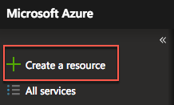

3. In the Search the Marketplace text box, type "Ubuntu Server 16.04 LTS VM" and select the same in the drop-down list that appears.

    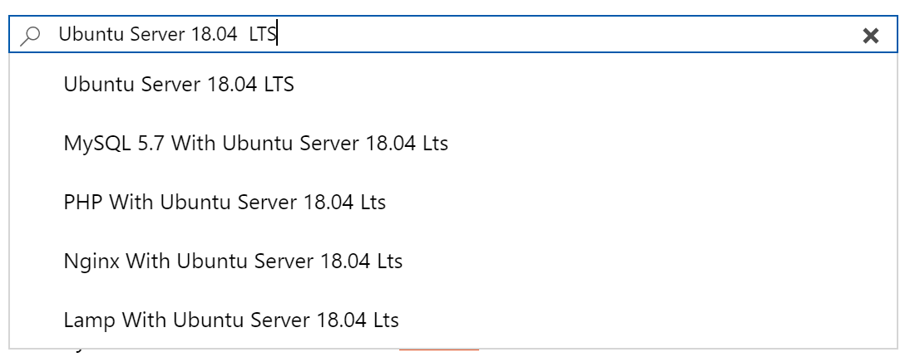

4. On the Ubuntu Server 16.04 LTS blade, leave the Select a deployment model at Resource Manager and select Create.

    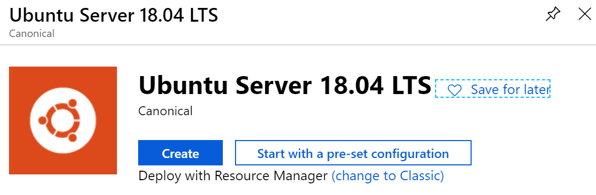

5. On the Create a virtual machine Basics tab, enter the following:

    - **PROJECT DETAILS**
        - **Subscription**: Select the subscription you are using for this hands-on lab.
        - **Resource group**: Select Create new and enter "hands-on-lab" for the resource group name.
    - **INSTANCE DETAILS**
        - **Virtual machine name**: Enter "batch-jumpbox".
        - **Region**: Select the region you are using for resources in this hands-on lab.
        - **Image**: Leave Ubuntu Server 16.04 LTS selected.
        - **Size**: Leave the default value selected (e.g., Standard D2s v3).
    - **ADMINISTRATOR ACCOUNT**
        - **Authentication type**: Select Password.
        - **Username**: labuser
        - **Password**: Password.1!!
        - **Login in with Azure Active Directory**: Select Off.
    - **INBOUND PORT RULES**
        - **Public inbound ports**: Select Allow selected ports.
        - **Select inbound ports**: Select SSH from the list.

    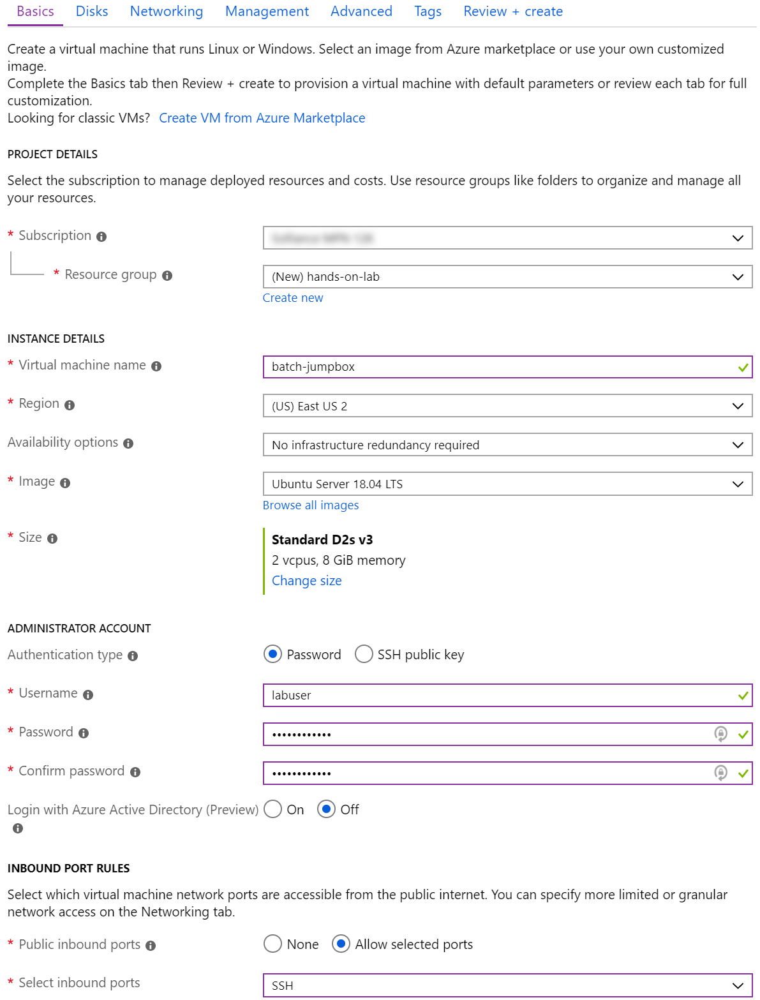

6. Select Next : Disks >.

7. On the Disks tab, select Standard HDD for the OS disk type, and select Review + create.

    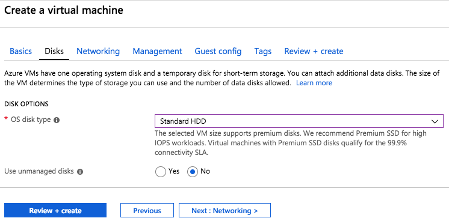

8. On the Create tab, ensure a Validation passed message is displayed, and select Create.

    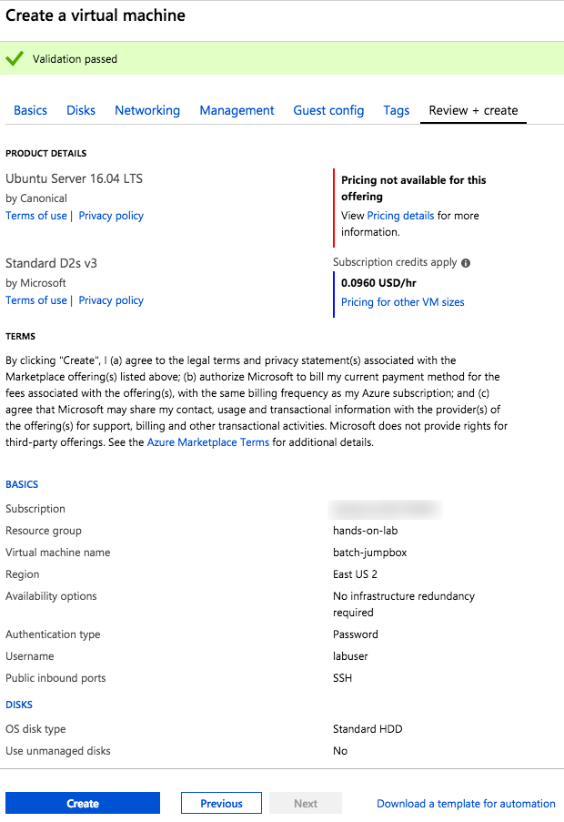

9. It will take about 3-5 minutes to deploy the jump box.

10. Once the VM is ready, navigate to the blade for the VM in the Azure Portal.

11. In the control bar, select Connect.

    

12. A dialog will appear showing the SSH command line to use to connect to the VM. Take note of the command, it includes the username (labuser in the below) and IP address (13.88.18.146 in the below) used to access the VM.

    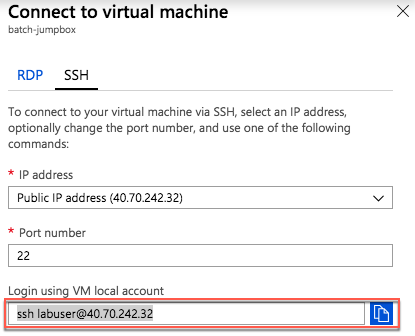

13. Using your favorite tool, SSH into the VM. Be sure to provide the username and password you specified when creating the VM. In the steps that follow we will use Bash on Ubuntu on Windows, but any SSH client will work.

    

14. Continue with the next task to complete the configuration of the VM.

### Task 2: Install the Azure CLI and Azure Batch Extensions

1. Install Azure CLI (upgrade CLI if needed).

2. Within your SSH session, run the following command to prepare for the CLI:.

    ```bash
    echo "deb [arch=amd64] https://packages.microsoft.com/repos/azure-cli/ xenial main" | \
             sudo tee /etc/apt/sources.list.d/azure-cli.list
    ```

3. Next, run the following commands to install the Azure CLI:

    ```bash
    sudo apt-key adv --keyserver packages.microsoft.com --recv-keys 52E16F86FEE04B979B07E28DB02C46DF417A0893
    sudo apt-get install apt-transport-https
    sudo apt-get update && sudo apt-get install azure-cli
    ```

4. Verify that the Azure CLI is installed by running:

    ```bash
    az
    ```

5. If you see output similar to the following, the install was a success:

    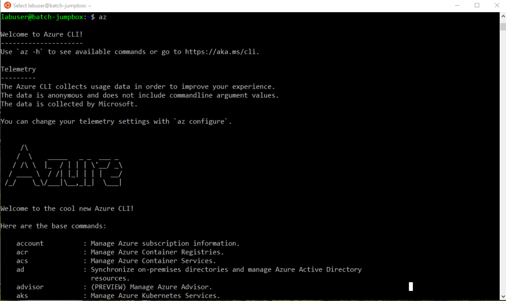

6. The Azure CLI includes most of the functionality that you need for Azure Batch. However, new capabilities that are still in preview (such as the Templates and File feature we will use in this lab) are installed by an extension, and are not available from default Azure CLI installation. Run the following command to install the Microsoft Azure Batch Extensions. Note that you can always determine the latest release by visiting <https://github.com/Azure/azure-batch-cli-extensions/releases> and copying the URL for the Python Wheel (.whl) corresponding to the latest release. Use that URL as the value for the Source parameter in the following command:

    ```bash
    az extension add --source https://github.com/Azure/azure-batch-cli-extensions/releases/download/azure-batch-cli-extensions-2.5.0/azure_batch_cli_extensions-2.5.0-py2.py3-none-any.whl
    ```

7. When prompted to install the extension, type Y and press enter.

8. You can verify if the extension was installed at any time by running:

    ```bash
    az extension list
    ```

9. If you see output similar to the following, the extension is properly installed:

    ```json
    [
      {
        "extensionType": "whl",
        "name": "azure-batch-cli-extensions",
        "version": "2.5.0"
      }
    ]
    ```

### Task 3: Provision Azure Batch

1. Navigate to Azure Portal in the browser.

2. Select + Create a resource.

3. Search the Marketplace for Batch Service.

    

4. In the list, select Batch Service.

    

5. Select Create on the Batch Service blade.

    

6. On the New Batch Account blade, specify the following:

    - **Account name**: Provide a name for your new Batch Account. The name you choose must be unique within the Azure region where the account is created (see Location below).

    - **Subscription**: Select the subscription in which to create the Batch account.

    - **Resource group**: Select the existing resource group you created for this lab (hands-on-lab) for your new Batch account.

    - **Location**: The Azure region in which to create the Batch account.

    - **Storage account**: Select Create new on the Choose storage account, then enter a globally unique name for the storage account, and leave the remaining values set to their defaults. Click OK.

    - **Pool allocation mode**: Set to Batch service.

        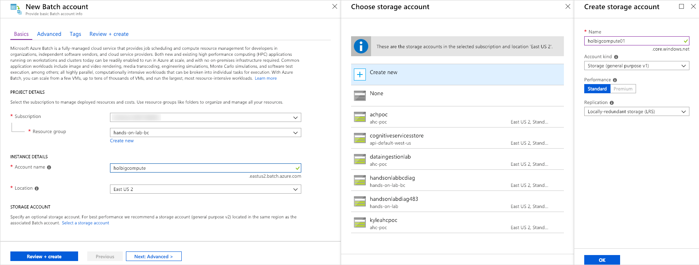

7. Select Create to create the new Batch account. The provisioning should only take a minute.

## Exercise 2: Creating Batch CLI templates and files

Duration: 60 minutes

In this exercise, you will resample video files in scale-out way by using Azure Batch. While there are multiple ways to accomplish this in Azure Batch, in this exercise you will use Batch templates and files, which enable you to perform scale-out execution of command line executables (in this case ffmpeg) without having to write any code.

### Task 1: Connect to Azure Batch with Batch Explorer

1. On your local machine, launch Batch Explorer and sign in when prompted.

2. Azure Batch Explorer will load to the Dashboard. You should see your newly created Batch account in the list and already selected with its details displayed. If you do not see your Batch account, verify you have the right subscription selected in the Subscriptions drop-down list and select the Refresh icon to reload the list.

    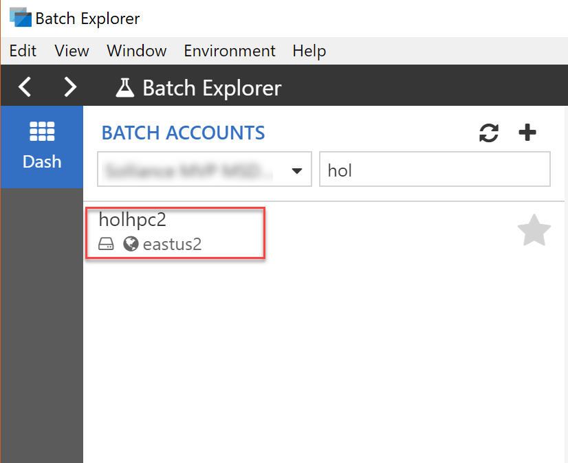

3. Take a moment to familiarize yourself with the dashboard overview for your Batch Account. Clockwise from the top-left:

    - The name, account endpoint and subscription in which your Batch Account live.

    - Pool usage, Job Quota and core usage (for both dedicated cores and low-priority cores).

    - The Storage account linked with your Batch Account.

    - App Packages, Pool Status and Job Status are empty as this Batch Account does not have any of these resources at the moment.

        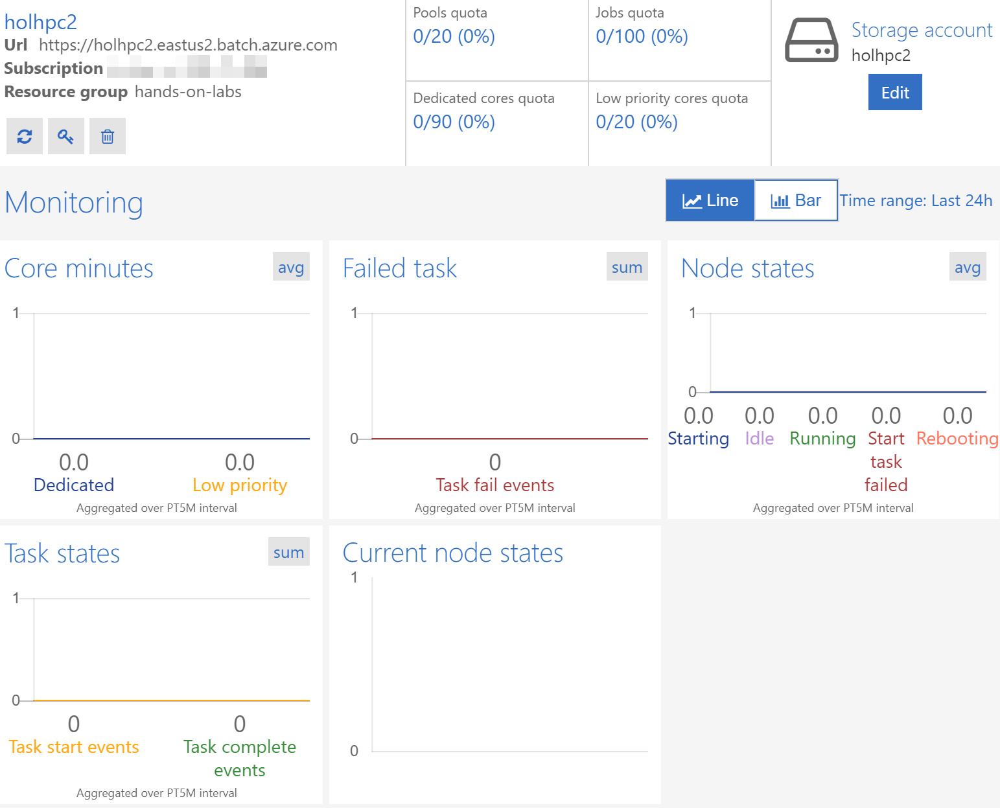

4. Keep Batch Explorer open and continue on to the next task.

### Task 2: Stage the sample videos to process

1. Open a browser and navigate to the following URL to preview the high-resolution video you will be down sampling:

    <http://sample-videos.com/video/mp4/720/big_buck_bunny_720p_30mb.mp4>\
    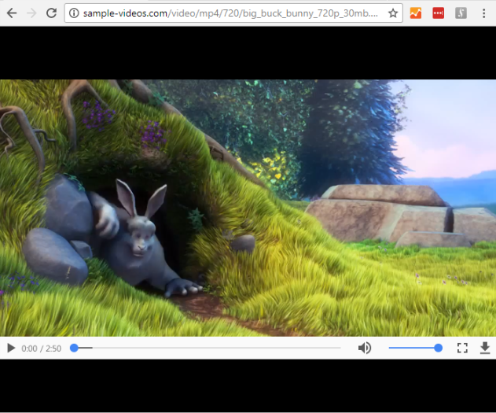

    (c) copyright 2008, Blender Foundation / www.bigbuckbunny.org

2. Next, return to the SSH connection you had open to the Jump Box.

3. Within the SSH session, create a folder called samples on the Jump Box and navigate into that folder.

    ```bash
    mkdir samples
    cd samples
    ```

4. Next, download the video you previously saw into this folder by running this command:

    ```bash
    wget http://sample-videos.com/video/mp4/720/big_buck_bunny_720p_30mb.mp4

    ```

    Make a few copies of the video to create some additional work for the processing we will perform:

    ```bash
    cp big_buck_bunny_720p_30mb.mp4 big_buck_bunny2_720p_30mb.mp4
    cp big_buck_bunny_720p_30mb.mp4 big_buck_bunny3_720p_30mb.mp4
    cp big_buck_bunny_720p_30mb.mp4 big_buck_bunny4_720p_30mb.mp4
    cp big_buck_bunny_720p_30mb.mp4 big_buck_bunny5_720p_30mb.mp4
    cp big_buck_bunny_720p_30mb.mp4 big_buck_bunny6_720p_30mb.mp4
    cp big_buck_bunny_720p_30mb.mp4 big_buck_bunny7_720p_30mb.mp4
    cp big_buck_bunny_720p_30mb.mp4 big_buck_bunny8_720p_30mb.mp4
    cp big_buck_bunny_720p_30mb.mp4 big_buck_bunny9_720p_30mb.mp4
    cp big_buck_bunny_720p_30mb.mp4 big_buck_bunny10_720p_30mb.mp4
    ```

5. These videos are currently staged on the Jump Box, but in order to process them using Azure Batch, you will need to copy them over to Azure Storage.

6. Before you can use the Azure CLI, you will need to login:

    ```bash
    az login
    ```

7. You will see a prompt similar to the following in the SSH terminal:

    To sign in, use a web browser to open the page https://aka.ms/devicelogin and enter the code BDQGEJR7V to authenticate.

8. Open the supplied URL in a browser and then paste in the supplied code:

    

9. Select Continue to proceed with the login.

    

10. Sign in with the credentials you use to access your Azure Subscription.

    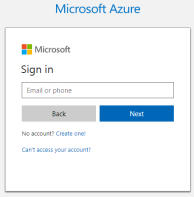

11. After logging in, return to SSH prompt. It should update by displaying your list of subscriptions.

    >**Note**: On some SSH clients, pressing ENTER might be required to trigger the update of the screen.

12. Select the Subscription that contains your Batch Account by running the following (be sure to substitute your own subscription name or subscription ID):

    ```bash
    az account set --subscription subscriptionNameOrID
    ```

13. Login to your Batch Account by executing the following command (be sure to replace the batchAccountName with the name of your Batch Account):

    ```bash
    sudo az batch account login -g hands-on-lab -n batchAccountName
    ```

14. Copy the video files from your Jump Box to the linked Storage Account by using the following command from the Batch Extensions (be sure to substitute in your batchAccountName and location, which you can acquire from Batch Explorer or the Azure Portal):

    ```bash
    sudo az batch file upload --local-path . --file-group ffmpeg-input --account-name batchAccountName --account-endpoint batchAccountName.location.batch.azure.com
    ```

15. When the command completes, the 10 videos will be copied into Azure Storage and a File Group (a logical way to refer to the set of videos) will be created in Azure Batch.

### Task 3: Verify video uploads

1. Next launch Azure Storage Explorer.

2. If you have not used Azure Storage Explorer with your Azure Subscription before, select Add account.

    

3. Leave Add an Azure Account selected and the Azure environment set to Azure and select Sign in...

    

4. Sign in with your Azure account credentials.

    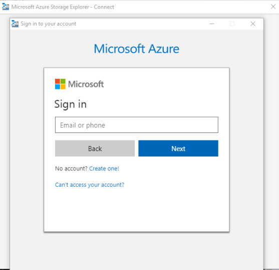

5. Use the Settings blade that appears to select just the Azure subscription containing your Batch Account and select Apply.

    

6. From the Explorer tree-view, expand your Subscription, then Storage Accounts until you see the Storage Account that is linked with Batch, expand Blob Containers and then double click on the container named fgrp-ffmpeg-input. You should see a listing that includes the 10 MP4 files you previously uploaded.

    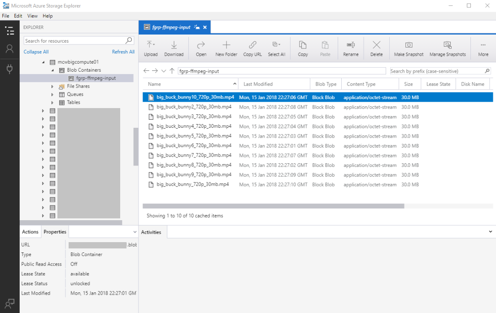

### Task 4: Create an Azure Batch Pool Template

An Azure Batch Pool Template enables an experienced Batch user to provide a simplified approach for less experienced Batch users or applications to create a Batch Pool, exposing of the configuration only the parameters the end user or application is truly concerned about. In this task, you will create a Pool Template that creates a Batch Pool which will automatically download and install the ffmpeg utility to each node in the Pool using the apt package manager included with Ubuntu Linux. By defining the Pool in this way, you avoid having to write any script code that would have to run on each node at start-up in order to install ffmpeg---the configuration of each node is effectively performed declaratively.

1. Return to your SSH session on the Jump Box.

2. From within the samples folder, create a new file name pool.json and open it the nano text editor:

    ```bash
    nano pool.json
    ```

3. The nano editor will launch with a blank document.

    

4. Pools are defined as JSON documents, begin by creating an empty document with the following three lines:

    ```json
    {

    }
    ```

5. Within the document, you need to define two major sections: one that describes the required parameters (that would need to be supplied by and end user or application), and one that provides the template body (which describes the actual configuration of the deployed template and references any user supplied parameters.

6. Begin by adding the parameter definition by pasting the following JSON in the second line between the open and closed curly brace:

    ```json
        "parameters": {
            "nodeCount": {
                "type": "int",
                "metadata": {
                    "description": "The number of pool nodes"
                }
            },
            "poolId": {
                "type": "string",
                "metadata": {
                    "description": "The pool id "
                }
            }
        },
    ```

7. Review the JSON just added. You have defined two parameters, a nodeCount of type int and a poolId of type string.

8. Next, in the line below the JSON you just added (just below the "}," add the following template body:

    ```json
        "pool": {
            "type": "Microsoft.Batch/batchAccounts/pools",
            "apiVersion": "2016-12-01",
            "properties": {
                "id": "[parameters('poolId')]",
                "virtualMachineConfiguration": {
                    "imageReference": {
                        "publisher": "Canonical",
                        "offer": "UbuntuServer",
                        "sku": "16.04.0-LTS",
                        "version": "latest"
                    },
                    "nodeAgentSKUId": "batch.node.ubuntu 16.04"
                },
                "vmSize": "STANDARD_D3_V2",
                "targetDedicatedNodes": "[parameters('nodeCount')]",
                "enableAutoScale": false,
                "maxTasksPerNode": 1,
                "packageReferences": [
                    {
                        "type": "SPECIFY_PACKAGE_MANAGER",
                        "id": "SPECIFY_PACKAGE"
                    }
                ]
            }
        }
    ```

9. Review the JSON just added. In it you have defined the pool object, which is of type "Microsoft.Batch/batchAccounts/pools". That pool will have an ID whose value will come from the poolId parameter, and will consist of Ubuntu Server 16.04 LTS Linux instances and will have the appropriate Azure agent installed (for managing the node), as is specified by the virtualMachineConfiguration object. The size of each node is specified by the vmSize object (and is hard coded to a Standard D3v2). The number of nodes in the pool will be set by using the value from the nodeCount parameter (and supplied by the end user of the template). The next two objects "enableAutoScale" and "maxTasksPerNode" are configured so that only nodeCount number of nodes are ever created in the pool, and that each node can run at most 1 instance of the task (ffmpeg). The packageReferences object is where you can configure what dependencies to automatically install on each node using a package manager.

10. You may have noticed that the type and id of the one packageReference in the packageReferences collection was left with values still needing to be specified. In this case, we want to use the apt package manager to install the ffmpeg package. To do so, within the nano editor replace the SPECIFY\_PACKAGE\_MANAGER with aptPackage and SPECIFY\_PACKAGE with ffmpeg, so that it looks as follows:

    ```json
            "packageReferences": [
                {
                    "type": "aptPackage",
                    "id": "ffmpeg"
                }
            ]
    ```

11. Save the JSON file by selecting Write Out by typing Control + O followed by Enter to leave the name set to pool.json. Use Control + X to quit nano.

12. The template for the pool is now ready for use by an end user.

### Task 5: Create an Azure Batch Job Template

The first step in building a Batch Job is understanding the command line of the tool you want to execute when the task runs. In this case we want to run ffmpeg. In this task, you will become familiar with the command line for ffmpeg and then you will create a Job template that describes to Azure Batch how to invoke ffmpeg to resample each of the videos that were uploaded.

1. Return to your SSH session.

2. You can install ffmpeg using the apt-get package manager available within Ubuntu Linux. Run the following command to do so:

    ```bash
    sudo apt-get install -y ffmpeg
    ```

3. The general syntax of ffmpeg looks as follows:

    ```bash
    ffmpeg \[options\] \[\[infile options\] -i infile\]\... {\[outfile options\] outfile}\...
    ```

4. Next, resample one of the MP4 files found within the samples directory using ffmpeg. We use the -s option to indicate the desired width and height, followed by the strict option which allows the selection of the native FFmpeg AAC encoder:

    ```bash
    ffmpeg -i big_buck_bunny_720p_30mb.mp4 -y -s "428x240" -strict -2 output.mp4
    ```

5. Within a minute or so the resampled video should be ready. Run the following command and verify that you have an output.mp4. How does the size of this file compare to the other MP4 files in this directory?

    ```bash
    ls -hl
    ```

6. Delete the output file before proceeding, since we were just testing out the FFmpeg command:

    ```bash
    rm output.mp4
    ```

7. Now that you understand the command line we want to run across our nodes in Batch, let's turn it into a Template that enables us to parameterize it so it doesn't run against just one file, but all the files in the input File Group. Within your SSH session, create a new JSON file called job.json by running the following command:

    ```bash
    nano job.json
    ```

8. Copy and paste the following complete job template:

    ```json
    {
        "parameters": {
            "poolId": {
                "type": "string",
                "metadata": {
                    "description": "The name of Azure Batch pool which runs the job"
                }
            },
            "jobId": {
                "type": "string",
                "metadata": {
                    "description": "The name of Azure Batch job"
                }
            },
            "resolution": {
                "type": "string",
                "defaultValue": "428x240",
                "allowedValues": [
                    "428x240",
                    "854x480"
                ],
                "metadata": {
                    "description": "Target video resolution"
                }
            }
        },
        "job": {
            "type": "Microsoft.Batch/batchAccounts/jobs",
            "apiVersion": "2016-12-01",
            "properties": {
                "id": "[parameters('jobId')]",
                "constraints": {
                    "maxWallClockTime": "PT5H",
                    "maxTaskRetryCount": 1
                },
                "poolInfo": {
                    "poolId": "[parameters('poolId')]"
                },
                "taskFactory": {
                    "type": "taskPerFile",
                    "source": { 
                        "fileGroup": "ffmpeg-input"
                    },
                    "repeatTask": {
                        "commandLine": "ffmpeg -i {fileName} -y -s [parameters('resolution')] -strict -2 {fileNameWithoutExtension}_[parameters('resolution')].mp4",
                        "resourceFiles": [
                            {
                                "blobSource": "{url}",
                                "filePath": "{fileName}"
                            }
                        ],
                        "outputFiles": [
                            {
                                "filePattern": "{fileNameWithoutExtension}_[parameters('resolution')].mp4",
                                "destination": {
                                    "autoStorage": {
                                        "path": "{fileNameWithoutExtension}_[parameters('resolution')].mp4",
                                        "fileGroup": "ffmpeg-output"
                                    }
                                },
                                "uploadOptions": {
                                    "uploadCondition": "TaskSuccess"
                                }
                            }
                        ]
                    }
                },
                "onAllTasksComplete": "terminatejob"
            }
        }
    }
    ```

9. Take a moment to understand what this template does (you can find complete documentation on the template syntax at <https://github.com/Azure/azure-batch-cli-extensions/tree/master/doc>). Let's begin with the parameters object. Similar to the parameters object created for the Pool template, this object enables you to expose the parameters that the user need to provide when running the Job. Notice that in this case, we require a poolId and a jobID as before. However, this template also supports a resolution parameter and uses the default value of "428x240" if the user does not supply a target resolution.

    ```json
        "parameters": {
            "poolId": {
                "type": "string",
                "metadata": {
                    "description": "The name of Azure Batch pool which runs the job"
                }
            },
            "jobId": {
                "type": "string",
                "metadata": {
                    "description": "The name of Azure Batch job"
                }
            },
            "resolution": {
                "type": "string",
                "defaultValue": "428x240",
                "allowedValues": [
                    "428x240",
                    "854x480"
                ],
                "metadata": {
                    "description": "Target video resolution"
                }
            }
    ```

10. Next, examine the job object. The type is specified as the Microsoft.Batch/batchAccounts/jobs type. Looking within the properties object, observe that the first two child objects are id (for the ID used to identify the job itself) and constraints. The constraints are set so that the job will run for at most 5 hours and will be try only once.

    ```json
    "job": {
            "type": "Microsoft.Batch/batchAccounts/jobs",
            "apiVersion": "2016-12-01",
            "properties": {
                "id": "[parameters('jobId')]",
                "constraints": {
                    "maxWallClockTime": "PT5H",
                    "maxTaskRetryCount": 1
                },
    ```

11. Next, the poolInfo object identifies the Pool within which this Job will run, using the Pool ID supplied as a parameter.

    ```json
                "poolInfo": {
                    "poolId": "[parameters('poolId')]"
                },
    ```

12. Next comes the crux of the template, the taskFactory object. A task factory saves you from having to write code that iterates over inputs to dynamically create templates that describe each task. In the below, the tastFactory is configured to as a type of "taskPerFile" which means it will spawn one task for each input MP4 file in the source (which is the input File Group ffmpeg-input). The repeatTask object specifies the parameterized command line for running FFmpeg, where the file names are effectively provided by the task factory as it iterates over each input coming from blobs stored in the Azure Storage account linked to the Batch account. When the task runs, one file will be downloaded from Azure Storage on to the local storage of the local node. Then this file is processed with FFmpeg. The outputFiles object tells the task to copy the files from the local node back to Azure Storage when the task has completed successfully.

    ```json
                "taskFactory": {
                    "type": "taskPerFile",
                    "source": { 
                        "fileGroup": "ffmpeg-input"
                    },
                    "repeatTask": {
                        "commandLine": "ffmpeg -i {fileName} -y -s [parameters('resolution')] -strict -2 {fileNameWithoutExtension}_[parameters('resolution')].mp4",
                        "resourceFiles": [
                            {
                                "blobSource": "{url}",
                                "filePath": "{fileName}"
                            }
                        ],
                        "outputFiles": [
                            {
                                "filePattern": "{fileNameWithoutExtension}_[parameters('resolution')].mp4",
                                "destination": {
                                    "autoStorage": {
                                        "path": "{fileNameWithoutExtension}_[parameters('resolution')].mp4",
                                        "fileGroup": "ffmpeg-output"
                                    }
                                },
                                "uploadOptions": {
                                    "uploadCondition": "TaskSuccess"
                                }
                            }
                        ]
                    }
                },
    ```

13. Save the JSON file by selecting Write Out by typing Control + O followed by Enter to leave the name set to job.json. Use Contol + X to quit nano.

14. The template for the job is now ready for use by an end user.

## Exercise 3: Running a Batch Job

Duration: 30 minutes

In this task you will provision the Batch Pool and use it to execute the resampling job that you defined previously.

### Task 1: Create a Pool using the Azure Batch Pool Template

In this task, pretend you are switching roles and are now the end user who has been handed the template to create a Pool designed for running ffmpeg jobs.

1. Within the SSH session, make sure you have navigated to the folder that contains the pool.json file.

2. Run the following command to create a new Batch Pool from the template (be sure to replace the batchAccountName and batchAccountLocation with the values specific to your Batch Account):

    ```bash
    sudo az batch pool create --template pool.json --account-name batchAccountName --account-endpoint batchAccountName.batchAccountLocation.batch.azure.com
    ```
    >**Note**: If you get an error running the above command along the lines of **'float' object cannot be interpreted as an integer**, follow these steps:

    - Use nano to edit this file:
        `nano /home/zoinertejada/.azure/cliextensions/azure-batch-cli-extensions/azext/batch/operations/task_operations.py`
        
    - Use Control + _  (control and underscore requires using the shift key), type 274 and press enter to go to line 274.
    
    - Replace the line:

        'if threads and threads > 0:'

        with:

        'if threads and threads >= 1:'

    - Select Control + O to save the changes, then control + x to exit nano.
    
    - Retry the az batch pool create command as before.

3. The command will prompt you for the values to use for the parameters, including the poolId and nodeCount. Provide these as follows:

    The behavior of this command has been altered by the following extension: azure-batch-cli-extensions.

    poolId (The pool id ): **resamplePool**

    nodeCount (The number of pool nodes): **5**

4. Switch to Batch Explorer and look at Dashboard for your Batch Account. In the Pool status panel, you should see that resamplePool listed, that it is a Linux pool (indicated by the Penguin icon) and that it is resizing from 0 to 5 instances (as it provisions the VM nodes in the pool).

    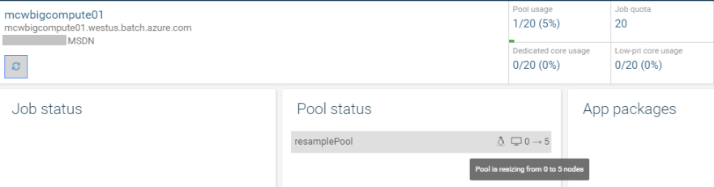

5. It will take about 2-3 minutes for the Pool to be ready (at which point the resamplePool status will show a fixed 5 instances).

    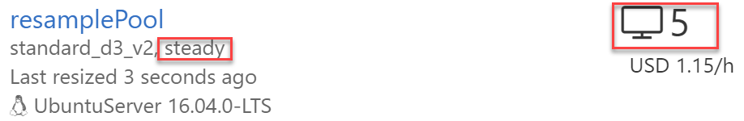

6. This means the VM nodes in the pool are ready for some work. Continue with the next task to supply some work.

### Task 2: Create and Run a Job using the Azure Batch Job Template

In this task, you will continue in the role of the end user, this time using the Job Template that was supplied for running ffmpeg.

1. Return to the SSH session, make sure you have navigated to the folder that contains the job.json file.

2. Run the following command to create and run the job to resample the videos. Be sure to replace batchAccountName and batchAccountLocation as appropriate.

    ```bash
    sudo az batch job create --template job.json --account-name batchAccountName --account-endpoint batchAccountName.batchAccountLocation.batch.azure.com
    ```

3. The command will prompt you for the values to use for the parameters, including the jobId and poolId. For these parameters, specify "firstResample" and "resamplePool" respectively.

    ```bash
    The behavior of this command has been altered by the following extension: azure-batch-cli-extensions.

    jobId (The name of Azure Batch job): **firstResample**

    poolId (The name of Azure Batch pool which runs the job): **resamplePool**
    ```

4. Return to Batch Explorer to monitor the job.

5. From the Dashboard, refresh the Batch Account and observe that firstResample is now listed under Job status (and it is active).

    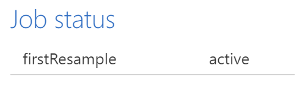

6. Select firstResample to drill into the details of the Job. Observe the overall status of the Job is displayed at the top-left, near the Job name. Also, each of the tasks is indicated in the list with its status.

    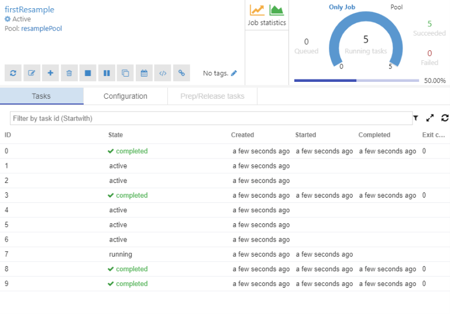

7. Select the Refresh button () periodically until you see the status change from Active to Completed.

    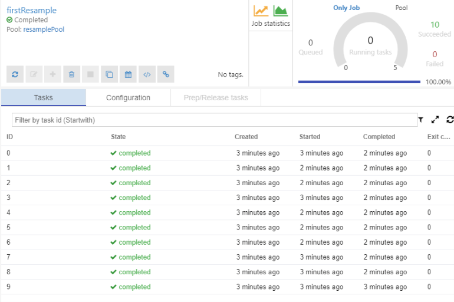

8. From the Job dashboard, select the Job statistics panel.

    

9. The first chart displayed is a scatter plot (with some faint green dots where each dot represents a single task) showing how long each task took to run. About how long did all of your tasks take to run?

    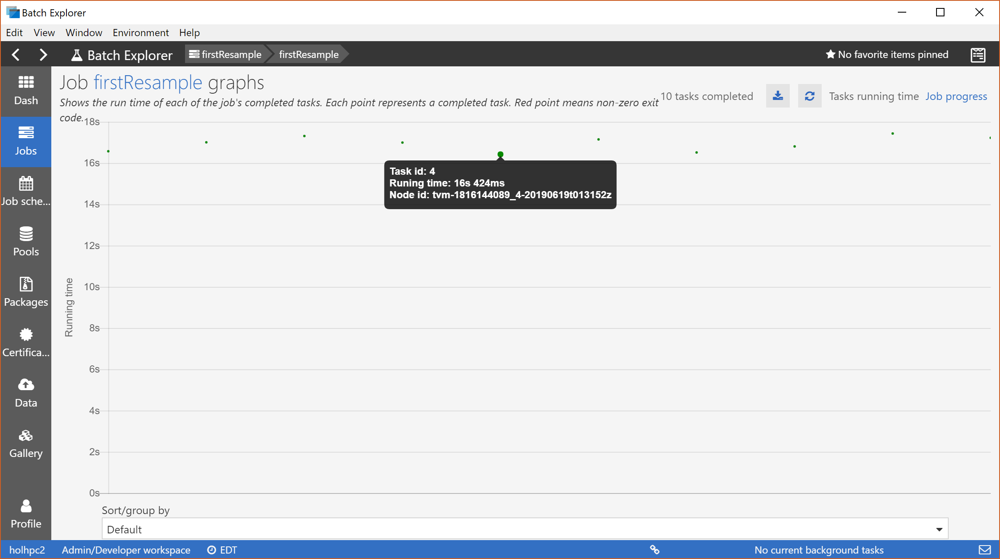

10. At the top right, there is a toggle that to show Job Progress. Select the Job Progress link.

    

11. The Job Progress chart is displayed, that summarizes the spread of time taken to start and end all tasks, as the number of tasks running increases. Recall the Batch Pool was configured with 5 nodes, where each node could run only one task at a time. Your chart should show the first 5 tasks running right away, and then the next set of 5 tasks start as soon as the previous tasks begin to finish, and slots open up on the nodes.

    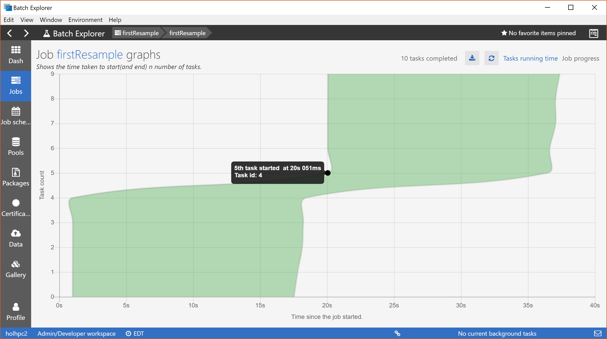

12. Next, you want to understand which task processed which of the files. Select the Jobs tab on the left, then select the firstResample job. In the tasks list, select any one of the tasks.

    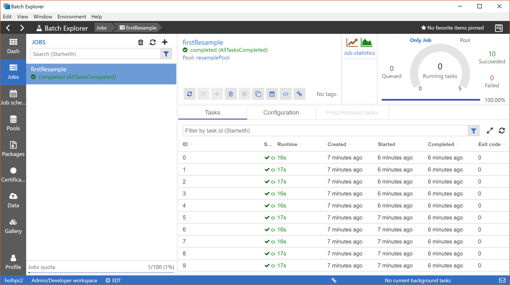

13. This will take you to the task details. Notice that by default the Task Outputs tab is selected. In the Node Files tree view, select the folder called wd (this name is short for "working directory"). Observe that this folder has two MP4 files in it. One is the source file (in the screenshot below it is the big\_buck\_bunny2\_720p\_30mb.mp4 file) that was resampled, and the other file is the resampled output file (big\_buck\_bunny2\_720p\_30mb\_428x240.mp4 in the screenshot).

    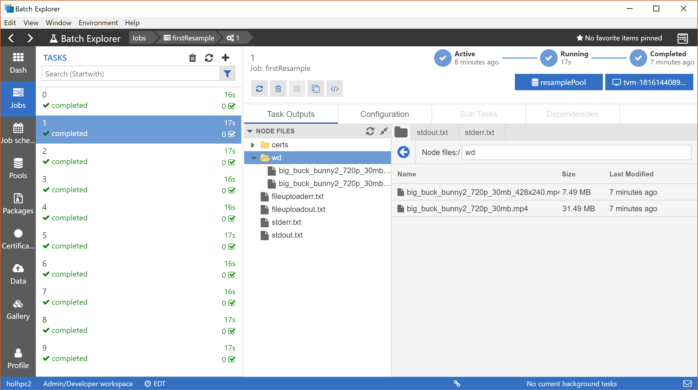

14. So how can you easily see all of the inputs and outputs for a job, across all tasks? Recall we configured the input files to use the notion of a File Group. A File Group is also created to contain all output files. To view these, select the Data tab from the menu on the left, and then choose a File Group. For output File Groups, all of the files belonging to that File Group, regardless of which task may have produced them, are listed.

    

15. Select the File Group ffmpeg-output.

16. In the list of files, select big\_buck\_bunny\_720p\_30mb\_428x240.mp4.

17. In the ribbon of buttons that appears, select the rightmost button with the tool tip "Open in default application" to download and view the resampled version of the video on your local computer.

    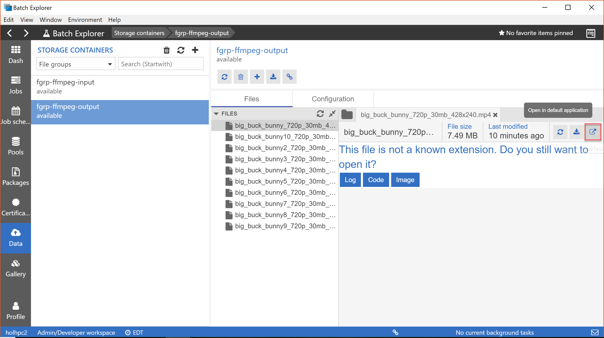

    (c) copyright 2008, Blender Foundation / www.bigbuckbunny.org

## Exercise 4: Scaling a Pool

Duration: 45 minutes

In this exercise you will configure the resamplePool so that it starts with zero nodes. You will define an Autoscale Formula that will automatically scale up the number of nodes in the pool when there are tasks to process. When all tasks have completed, the pools will scale back down to zero nodes in the pool.

### Task 1: Enable Autoscale on the Pool

1. Using a browser, navigate to the Azure Portal and then to the blade for your Batch Account. Select Pools.

    

2. In the Pools listing, select your resamplePool.

    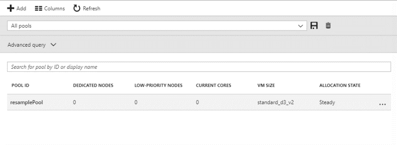

3. Select Scale from the command bar.

    

4. Before you can add AutoScale formulas, you first need to enable Auto scale, since this pool was created without Auto scale enabled. On the Scale pool blade, set the Mode toggle to Auto scale.

    
5. In order to save the change, you also need to provide a Formula. We'll get to writing an Auto scale formula that actually performs dynamic scaling momentarily, but for now simply enter the following formula which will set your Pool to have 0 nodes.

    ```powershell
    $TargetDedicated=0
    ```

6. Select Save.

    

7. Now that your Pool is enabled for Auto scale, you can evaluate the formulas you enter into the Formulas text box. Select the Evaluate button that appears and observe the result (basically it means we set to the pool size to 0 and terminates any tasks immediately, putting them back on the job queue so that they are rescheduled when nodes become available).

    

8. The pool will re-size to have zero nodes, but Auto scale will now be enabled.

### Task 2: Apply an Autoscale Formula

We had to enable Auto scale using the portal, but we can also edit the Auto scale formula using Batch Explorer. In this Task we will use Batch Explorer to configure the Auto scale.

1. Switch over to Batch Explorer.

2. Select the Pools tab, and then select the resamplePool to view the details.

    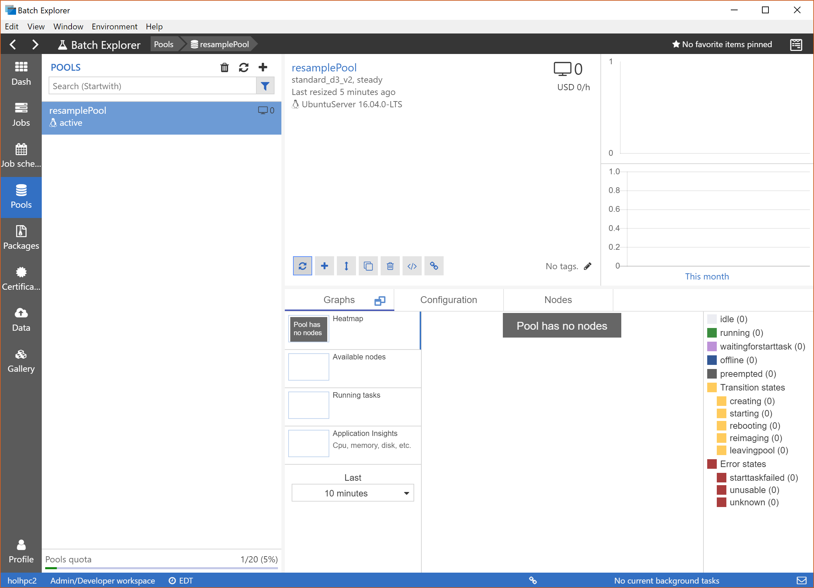

3. Select the Resize button.

    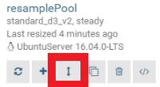

4. Your current Auto scale configuration will appear, similar to how it appeared in the Azure Portal. Observe that this UI provides some sample formulas in the list on the right. You can also save whatever you have typed in the text box by selecting the disk icon to the right of the Saved Formulas.

    

5. Set the Evaluation interval to 5 minutes. This is the shortest interval over which Batch will re-evaluate whatever code you supply for the Auto Scale formula.

    

6. Next, copy and paste the following Auto Scale formula into the text box:

    ```powershell
    //This formula assumes you have set the Evaluation Interval on the Pool to 5 minutes.

    // Get pending tasks for the past 5 minutes.
    $samples = $ActiveTasks.GetSamplePercent(TimeInterval_Minute * 5);

    // If we have fewer than 70 percent data points, we use the last sample point, otherwise we use the maximum of last sample point and the history average.
    $tasks = $samples < 70 ? max(0, $ActiveTasks.GetSample(1)) : max( $ActiveTasks.GetSample(1), avg($ActiveTasks.GetSample(TimeInterval_Minute * 5)));

    // If number of pending tasks is not 0, set targetVMs to pending tasks, otherwise half of current dedicated.
    $targetVMs = $tasks > 0 ? $tasks : max(0, $TargetDedicated / 4);

    // The pool size is capped at 4, if target VM value is more than that, set it to 4.
    cappedPoolSize = 4;
    $TargetDedicated = max(0, min($targetVMs, cappedPoolSize));

    // Set node deallocation mode - keep nodes active only until tasks finish
    $NodeDeallocationOption = taskcompletion;
    ```

7. Review the formula. This formula will be evaluated every 5 minutes (as dictated by the Evaluation Interval). The first line gets percentage of telemetry actually reported versus the total amount expected. To understand this, note that Batch samples the telemetry every 30 seconds. In a 5 minute windows, therefore, there are theoretically 10 samples to expect. However, not all samples are collected in time because of various latencies, or they may be lost, leading to a case where fewer than the expected number of samples is collected.

    ```powershell
    $samples = $ActiveTasks.GetSamplePercent(TimeInterval_Minute * 5);
    ```

8. In the next line, we determine how many samples were collected. If fewer than 70 percent of the expected samples were collected, then we determine the number of tasks from the very last sample we received. Otherwise, we choose the larger number of tasks provided by either the last sample or the average number of tasks over the last 5 minutes.

    ```powersehll
    $tasks = $samples < 70 ? max(0, $ActiveTasks.GetSample(1)) : max( $ActiveTasks.GetSample(1), avg($ActiveTasks.GetSample(TimeInterval_Minute * 5)));
    ```

9. Next comes the line which is critical to the number of nodes to scale up to or down to is calculated. In this line, if we a have one or more tasks, we simply allocate as many nodes as we have tasks. If we have no tasks to process, then we reduce the amount of VM's, dividing the amount we currently have allocated by 4. If the division by 4 yields a value less than 1 then this is effectively treated as 0 nodes. In the case of no tasks to process, this enables us to scale down gradually, every 5 minutes we might scale down the pool to 1/4^th^ its previous size.

    ```powershell
    $targetVMs = $tasks > 0 ? $tasks : max(0, $TargetDedicated / 4);
    ```

10. In the next two lines, we guard that our scaling calculation does not result in fewer than 0 nodes and no more than the maximum size we desire (in this case, we don't want it to be bigger than our pool size which has 4 VMs). With the assignment of TargetDedicated, a resizing operation may take place to adjust the pool size accordingly.

    ```powershell
    cappedPoolSize = 4;
    $TargetDedicated = max(0, min($targetVMs, cappedPoolSize));
    ```

11. The final line tells Azure Batch what action to take when nodes are to be removed from a pool. The value of taskcompletion means the Batch will wait for any currently running tasks to finish and then will remove the node from the pool.

    ```powershell
    $NodeDeallocationOption = taskcompletion;
    ```

12. Select Save in the Resize your pool dialog.

    

13. Verify that the Formula was applied, by selecting the Resize button again. If it did not save your Formula:

    - Navigate to the blade for you Batch Account and select your Batch Pool using the Azure Portal (as you did previously).

    - Select Scale.

    - Paste in the Formula into the Formula textbox.

    - Set the AutoScaleEvaluationInterval to 5 minutes.

    - Select Save.

        

14. As there are currently no Tasks scheduled for the Pool, the pool size should remain at 0 nodes. Continue on to the next Task to submit some work and to observe the behavior of your Auto Scale configuration.

### Task 3: Trigger and observe Autoscale

1. Return to your SSH session. You will submit a Job like you had done previously and observe how the Pool responds now that Auto Scale is configured.

2. Run the following command to create and run the job to resample the images. Be sure to replace batchAccountName and batchAccountLocation as appropriate.

    ```bash
    sudo az batch job create --template job.json --account-name batchAccountName --account-endpoint batchAccountName.batchAccountLocation.batch.azure.com
    ```

3. The command will prompt you for the values to use for the parameters, including the jobId and poolId. For these parameters, specify "scalingResampleTest" and "resamplePool" respectively.

    The behavior of this command has been altered by the following extension: azure-batch-cli-extensions.

    jobId (The name of Azure Batch job): **scalingResampleTest**

    poolId (The name of Azure Batch pool which runs the job): **resamplePool**

4. Return to Batch Explorer, select the Pools tab and select the resamplePool. You will monitor the scaling of the Pool using this view. It should start with no nodes, similar to the following:

    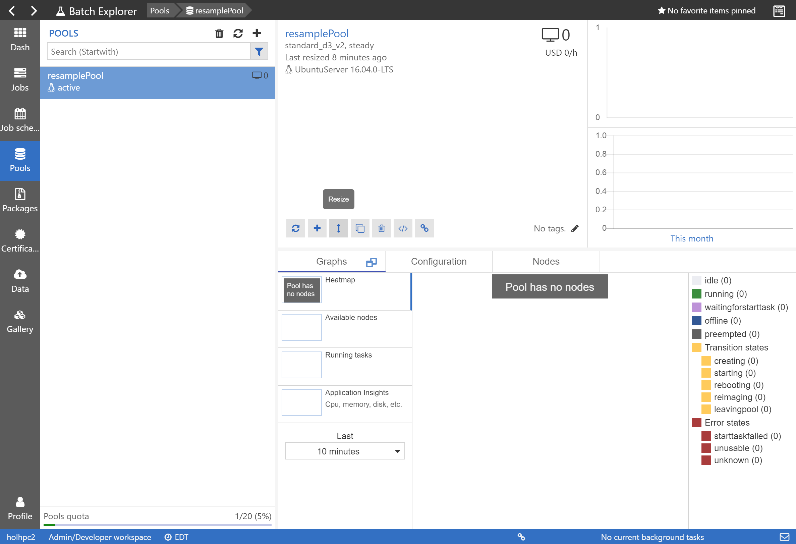

5. Within 1-5 minutes, you should see the Pool indicates it is scaling from 0-4 nodes. At this point, the pool will begin provisioning the VMs. The time this takes depends on when the Auto scale rule is re-evaluated.

    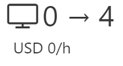

6. Within a minute or so, four nodes appear in the transitions of starting:

    

7. Once the VM nodes are provisioned, you should see them being setup as they are in the waitingforstarttask state.

    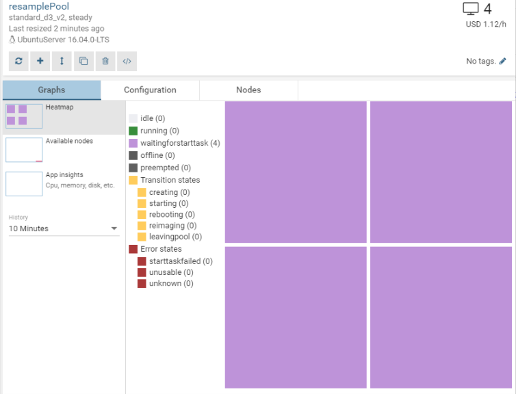

8. In a minute or so after that, the VM nodes will be ready and will begin running the tasks. You may see them flash thru the idle state before running.

    

9. As the tasks complete on each node, the state will be reported as idle.

    

10. When all tasks have completed, all 4 nodes will display an idle status. Since there are no more tasks queued, now they are basically waiting for the Auto Scaling rule to be re-evaluated.

    

11. Once the Auto scaling rule has been re-evaluated, which can take up to 5 minutes to occur, the pools is re-configured to scale from 4 nodes down to 1 node. The nodes selected to be removed from the pool have the state leavingpool.

    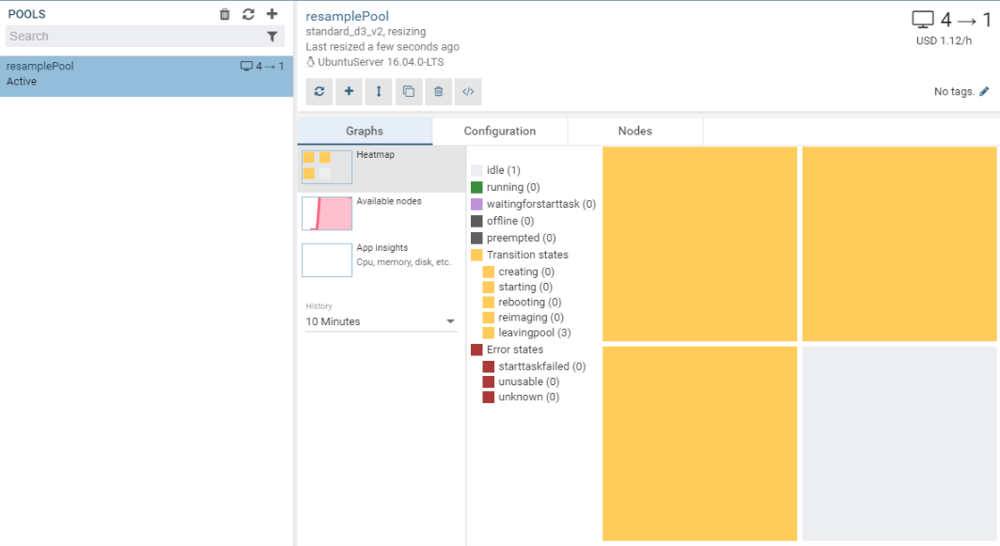

12. On the next evaluation of the Auto scaling rule, the Pool will resize from 1 to 0.

    

13. On the final evaluation, the remaining node is removed, and the Pool is left with 0 nodes.

    

14. If you were patient to sit thru this evaluation of the auto scale rules, hopefully your patience was rewarded as you witnessed a Batch Pool scale up from 0 nodes, to 4 nodes, process the queued tasks and then gradually scale back down to 0 nodes. All of this without any input from you.

## Exercise 5: 3D Rendering with the Batch Rending Service

Duration: 45 minutes

In this exercise you will use the Azure Batch Rendering Service to render a frame from a 3D animation program used in industry that is called 3D Studio Max. The Batch Rendering Service coupled with the Batch Explorer application means you don't have to write any code to render using a render farm provided by Azure Batch.

### Task 1: Create the File Groups

1. 3D animations are described in scene files. In this task you will use an example scene created with 3D Studio Max 2018. Download the sample scene from:

    <https://support.solidangle.com/download/attachments/40665256/Introduction-to-Arnold_robot_final.zip?version=1&modificationDate=1490281794000&api=v2>

2. Unzip the .max file into a folder called scene:

    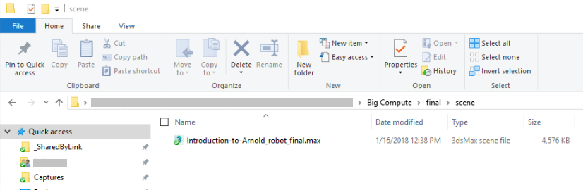.

3. Next go to the Data tab in Batch Explorer, under Storage Containers select File Groups in the drop-down. Then select the + to the right of the label Storage Containers and select From local folder (File group).

    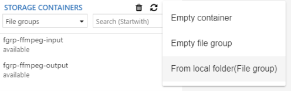

4. On the Create file group blade, provide:

    - **File group name**: Specify 3dsmax-input.

    - **Files**: Use the select a folder button to navigate to the Scene directory and select it.

    - **File Options**: Leave these at the default values.

    - Select Create and close.

        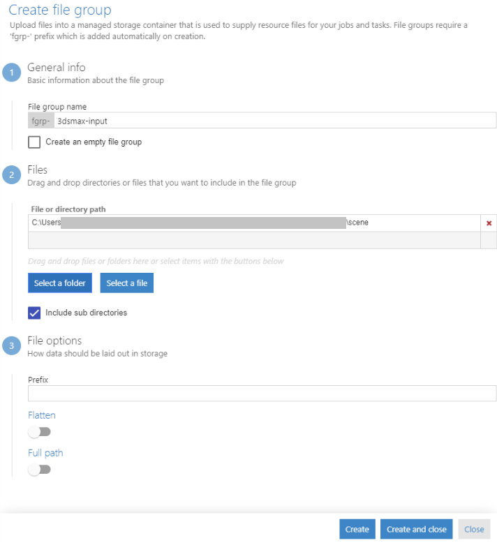

5. Next, you will create the file group that will contain the Job outputs. From the top select the + to the right of the label Storage Containers, and this time select Empty file group.

    

6. Provide the name 3dsmax-output and select Confirm to create the new file group.

    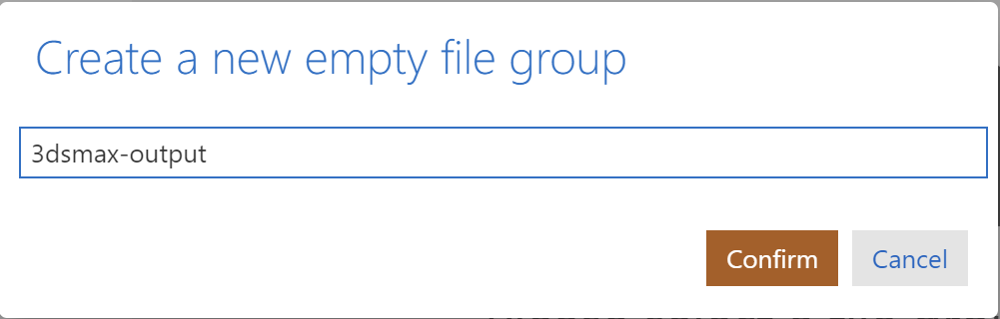

### Task 1: Render a 3ds Max Scene

1. Select the Gallery tab from the left.

    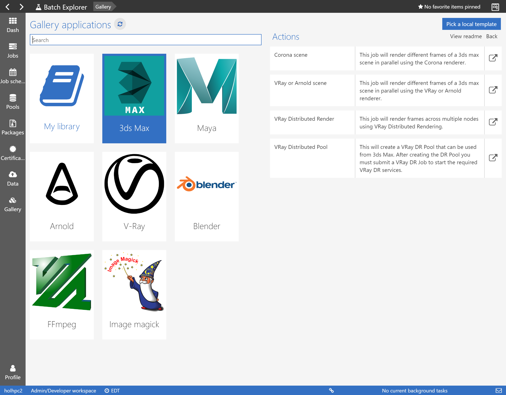

2. In the list of Market applications, select 3ds Max.

3. You will be presented with list of actions you can take with 3ds Max and Azure Batch. Select VRay or Arnold Scene.

    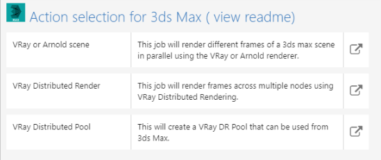

4. When using the Rendering Service, you can have the Pool automatically created according to the requirements of 3ds Max or you can supply your own (which requires you to properly configure such a Pool). Select Run job with auto pool.

    

5. In the Pool configuration, supply the pool name 3dsmax-Pool. Leave the number of nodes at 1 and the VM size at Standard\_D2\_V2.

    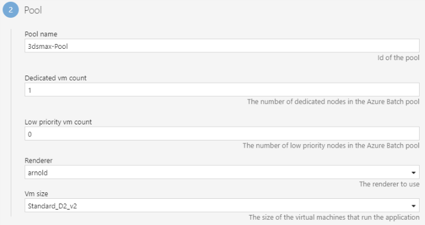

6. Next, configure the Job. Provide the following:

    - **Job Name: 3dsmax-arnold

    - **Input filegroup**: Select the fgrp-3dsmax-input file group from the list.

    - **Scene file**: Select the file Introduction-to-Arnold\_robot\_final.max in the file dialog that displays.

    - **Frame start**: Leave at 1, since we just want to render the first frame in this lab.

    - **Frame end**: Leave at 1, since we just want to render the first frame in this lab.

    - **Frame step**: Leave at 1, since we just want to render the first frame in this lab.

    - **Frame width**: Set this to 400. This will render an output that is 400 pixels wide.

    - **Frame height**: Set this to 300. This will render an output that is 300 pixels tall.

    - **Output filegroup**: Select the fgrp-3dsmax-output file group from the list.

        

7. Select the submit button to create the Pool and launch the render Job.

    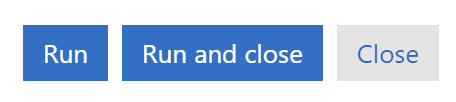

8. This will take you to the Jobs tab, with your new Job pre-selected.

    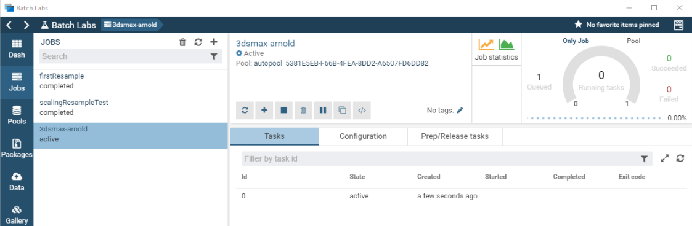

9. It will take about 5 minutes for the Pool and the single VM to be provisioned. While you wait, it is worth understanding what is happening behind the scenes. The Batch will deploy the VM using an image that already contains 3ds Max, this saves tremendous startup time because installing 3ds Max as a startup task could take 20 minutes alone. Additionally, this particular image is pre-configured to use the licensing for 3ds Max that is provided in Azure by Microsoft. This means you do not need to acquire a license for the VM, nor setup your own licensing infrastructure. Instead, the cost of the license is rolled into the per hour fee associated with this Marketplace image.

10. While you wait, you can check out the Pool status to see how the provisioning of the node is proceeding. Use the Pools tab and then select the autopool that was created.

    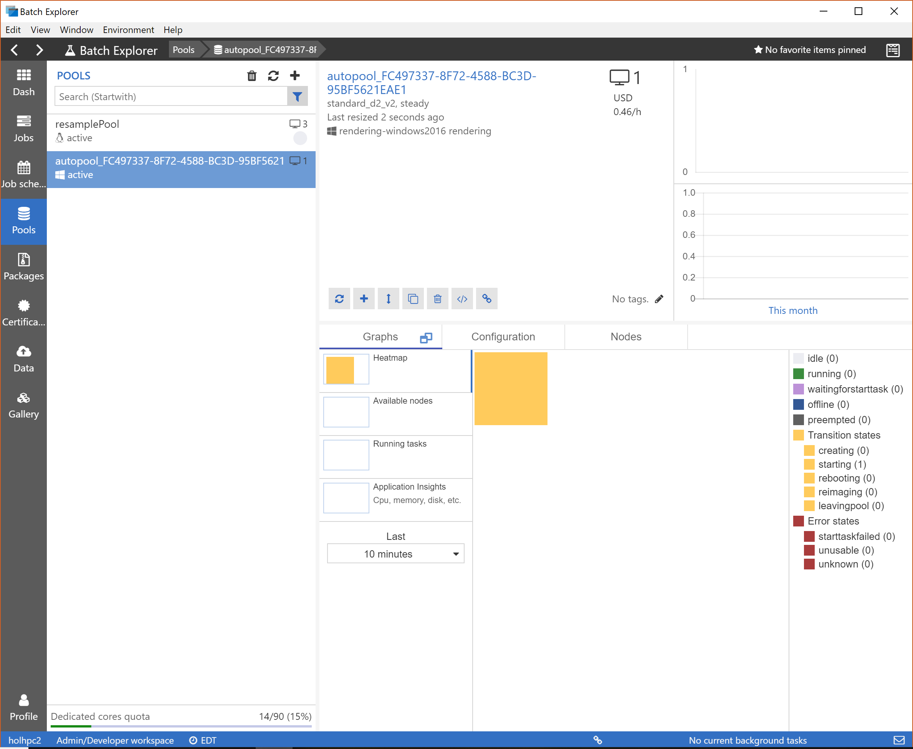

11. Once the node is ready, it will flash thru the idle status and then begin running the render job (it's status will be running).

    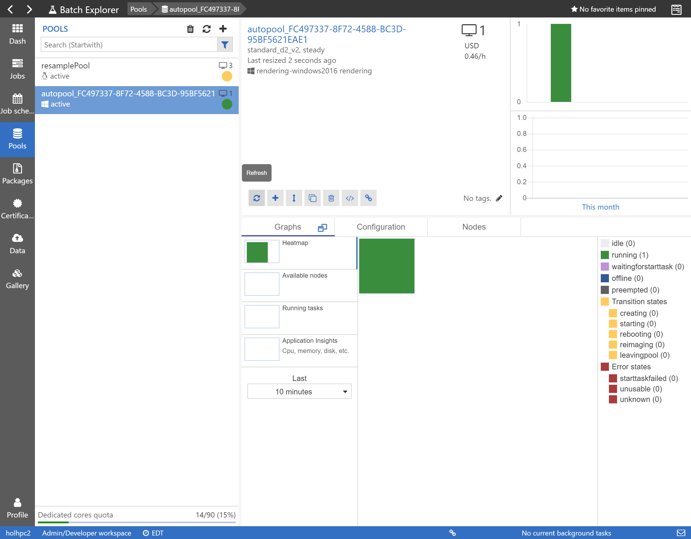

12. It will take about 15 minutes to complete the job, return to the Jobs tab and select the 3dsmax3-arnold job to monitor the progress.

    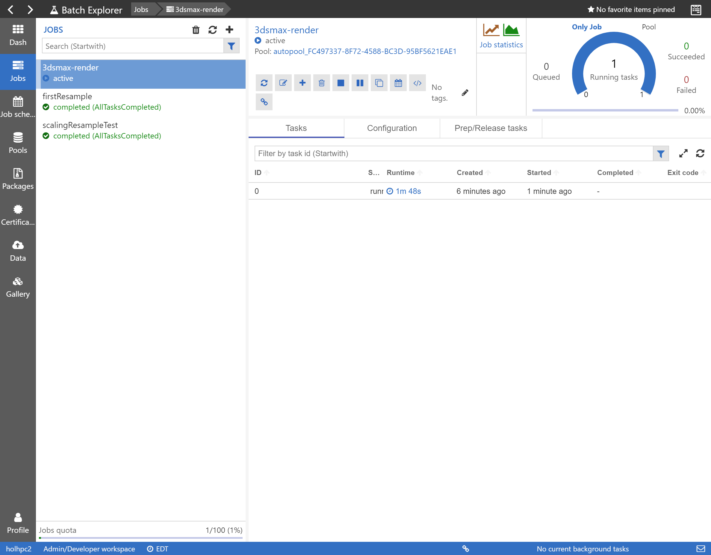

13. When the single task is completed, select the Data tab, select the 3dsmax-output file group and then in the tree view expand the outputs folder. Select the JPG image that appears there. Your rendered, 3D robot still frame is ready!

    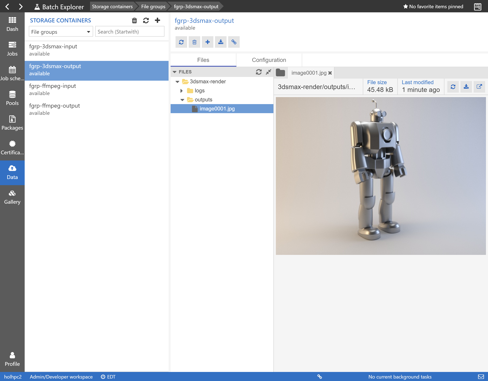

14. Return to the Jobs tab, and observe that the Job is also automatically terminating.

    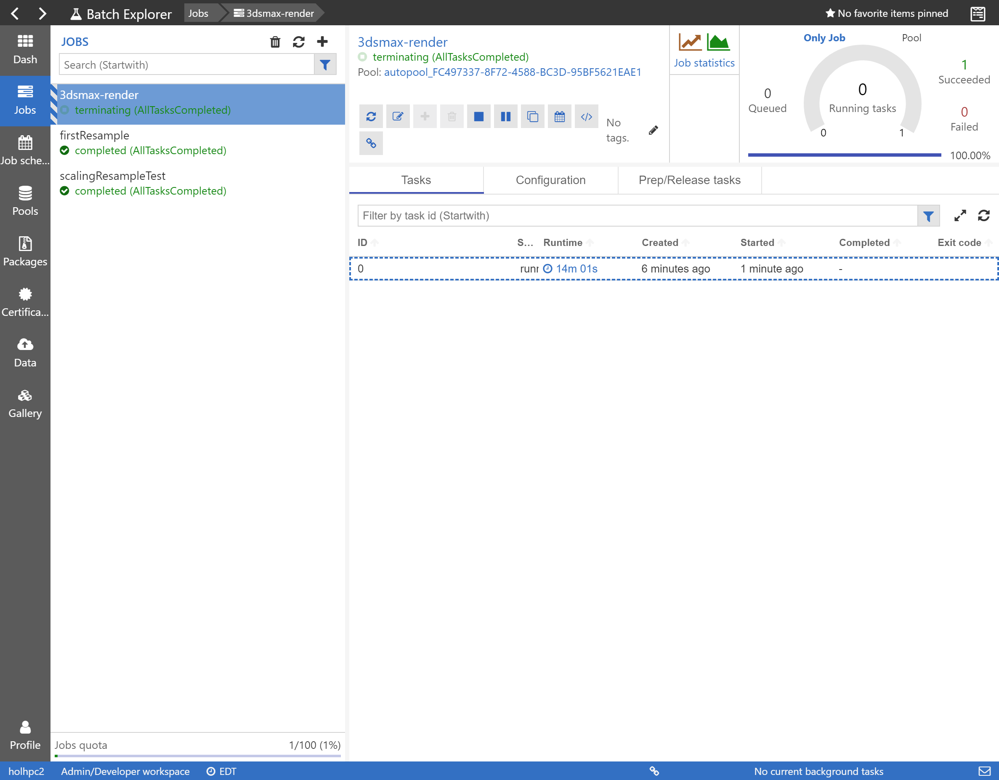

15. Switch to the Pools tab and observe that the autopool is also being deleted automatically.

    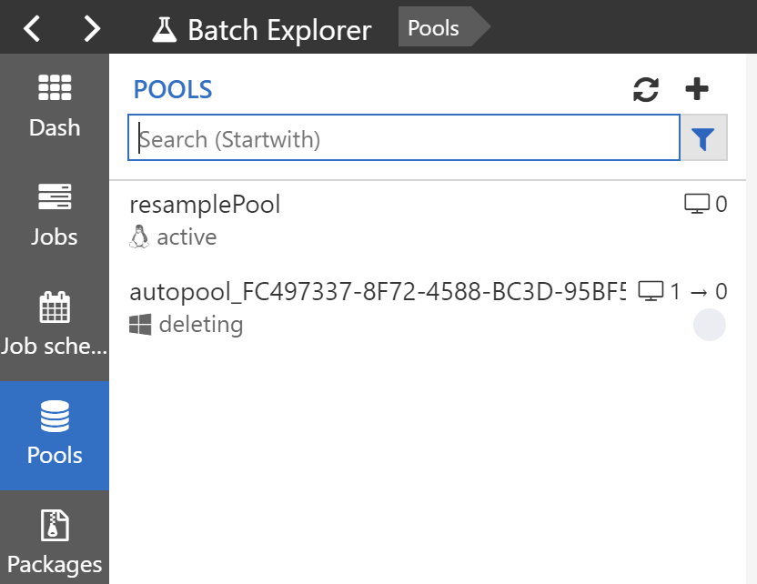

16. In a few moments your Pool will be cleaned up. The output files will remain in Azure Storage.

17. You can Continue to the lab cleanup exercise, you don't have to wait.

## After the hands-on lab

Duration: 10 minutes

Before you conclude the lab, you should make sure to cleanup all the resources used by the lab.

### Task 1: Cleanup the Lab Resource Group

1. Navigate to the Azure Portal and locate the Resource Group you created for this lab (mcw-lab-big-compute).

2. Select Delete resource group from the command bar.

    

3. In the confirmation dialog that appears, enter the name of the resource group and select Delete.

    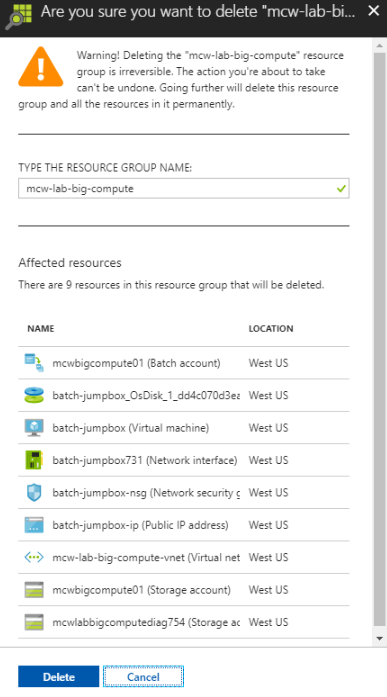

4. Wait for the confirmation that the Resource Group has been successfully deleted. If you don't wait, and the delete fails for some reason, you may be left with resources running that were not expected. You can monitor using the Notifications dialog, accessible from the Alarm icon.

    

5. When the Notification indicates success, the cleanup is complete.

    

You should follow all steps provided *after* attending the Hands-on lab.
